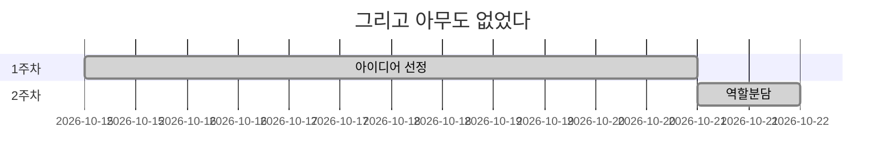

# README

## 그리고 아무도 없었다 개요

> ㅇㅇㄹ

### Why 그리고 아무도 없었다

> 게임의 설정 상 Shadow가 탐정들에게 걸리지 않는 이상 마지막에 Shadow의 정체를 밝혀주지 않습니다. 그렇기 때문에 결과적으로 마지막엔 아무도 남지 않는다라는 의미로 그리고 아무도 없었다라는 이름으로 탄생하게 되었습니다.


## Install

> 기본 및 이외 설정은 [settings](./output/document/settings.md)를 참고하세요


## Project Construction

> 해당 프로젝트는 
>
> - BackEnd(`Spring` & `Django`)
> - FrontEnd(`Vue.js`)
> - DataBase(`Mysql`)
> - AI(`Tensorflow(Django)`)
>
> 로 구성되어 있습니다

```python
📦PJT
 ┣ 📂game-front				# FrontEnd
 ┃ ┣ 📂assets
 ┃ ┣ 📂public
 ┃ ┣ 📂src
 ┣ 📂gameBack				# UserServer(BackEnd/Django)
 ┃ ┣ 📂accounts						## 유저 계정 관련 App
 ┃ ┣ 📂gameBack						## UserServer setting
 ┣ 📂gamAI					# AIServer(BackEnd/Django)
 ┃ ┣ 📂detection					## AI detection 관련
 ┃ ┣ 📂gameAI						## UserServer setting
 ┃ ┣ 📂objects						## AI 처리해야할 objects 관련 App
 ┣ 📂gameBack_Lobby			# LobbyServer(BackEnd/spring)
 ┃ ┣ 📂src/main/java(이하생략)
 ┣ 📂gameBack_InGame		# InGameServer(BackEnd/spring)
 ┃ ┣ 📂src/main/java(이하생략)
 ┣ 📂outputs				# 산출물
 ┃ ┣ 📂Database						## DB 관련
 ┃ ┣ 📂Document						## 관련 문서
 ┃ ┣ 📂Images						## 관련 이미지파일
 ┗ 📜README.md				# 프로젝트 README
```

- 각 서버의 구조는 해당 서버의 md 파일에서 확인할 수 있습니다.
  - [Frontend (클릭 시 이동)](./output/document/frontend.md)
  - [UserServer (클릭 시 이동)](./output/document/UserServer.md)
  - [AIServer (클릭 시 이동)](./output/document/AIServer.md)
  - [InGameServer (클릭 시 이동)](./output/document/InGameServer.md)
  - [LobbyServer (클릭 시 이동)](./output/document/LobbyServer.md)
  
- 각 서버의 포트 번호

  | 서버         | 디렉토리명      | 포트번호 |
  | ------------ | --------------- | -------- |
  | UserServer   | gameBack        | 8000     |
  | LobbyServer  | gameBack_Lobby  | 8001     |
  | InGameServer | gameBack_InGame | 8002     |
  | AIServer     | gameAI          | 8005     |
  | DB           | -               | 3306     |


## Tech Stack

### :black_small_square: Tools

| Tool            | 기술                                                         |
| :-------------- | ------------------------------------------------------------ |
| GitLab          | 기능 별 branch를 나눠서 코드 버전 관리 (dev-`epic명`-`story명`) |
| Jira            | Issue 관리를 위해 Git과 연동하여 사용                        |
| Scrum Pocker    | Jira Issue 별 스프린트 시간 관리를 위한 어플리케이션         |
| VS Code         | `django` & `vue.js` 구현을 위한 tool                         |
| STS             | `Spring` 구현을 위한 tool                                    |
| Mysql workbench | `DataBase` 구현을 위한 tool                                  |
| Google Chrome   | 구현한 화면을 출력하기 위한 브라우저                         |

### :black_small_square: Library

| Library     | 내용                                                      |
| ----------- | --------------------------------------------------------- |
| Spring      | Backend 구현을 위한 java web framework (`Lobby`/`InGame`) |
| Django      | Backend 구현을 위한 python web framework (`User`/`AI`)    |
| Vue.js      | Frontend 구현을 위한 javascript web framework             |
| Tensor-flow | 이미지 처리(CNN)을 위한 Open Source 머신러닝 플랫폼       |
| Websocket   | Backend와 Frontend의 실시간 통신                          |
| Stomp       | 이미지 Canvas의 마우스 트래킹을 위한 소켓                 |
| axios       | Backend와 Frontend의 비동기 통신                          |

### :black_small_square: Software Language

| Language            | 기술                             |
| ------------------- | -------------------------------- |
| Java                | Backend 구현 언어                |
| Python              | Backend 및 이미지 처리 구현 언어 |
| JavaScript/HTML/CSS | Frontend 구현 언어               |
| SQL                 | DataBase 구현 언어               |


## Screen Configuration

> Main 화면 외 화면들은 [Screen](./output/document/Screen.md)를 참고하세요


## 기술 설명

### ERD

...

### Wire Frame

> [StoryBoard](./output/document/StoryBoard.md)를 참고하세요


##  Color

> 게임의 컨셉이 `미스터리`인 관계 상 검은색(Black)을 기준으로 어두운 분위기의 탁색을 사용했습니다.
>
> 화면의 위에 올라가는 컴포넌트들은 투명도를 적용하여 배경이 비치도록 설정하여 은밀하게 보이는 듯한 효과를 주었습니다.


## Develop

### :black_small_square: Develop Period




### :black_small_square: Developer

- 조대흠(conquerer1209@gmail.com): Backend(Spring), 서버 배포
- 박상현(park03851@naver.com): Backend(Spring), Frontend
- 김호한(ghgksdk123@naver.com): AI, Backend(Spring)
- 유수정(yusj1231@gmail.com): Frontend, AI 서버 구현(Django)
- 황신실(ohgyosin@naver.com): Backend(Django), Frontend


## © Copyright 

해당 프로젝트는 삼성 소프트웨어 아카데미(SSAFY)를 통해 진행되었습니다.  해당 기관의 동의없이 해당 프로젝트를 임의로 재배포할 수 없습니다.