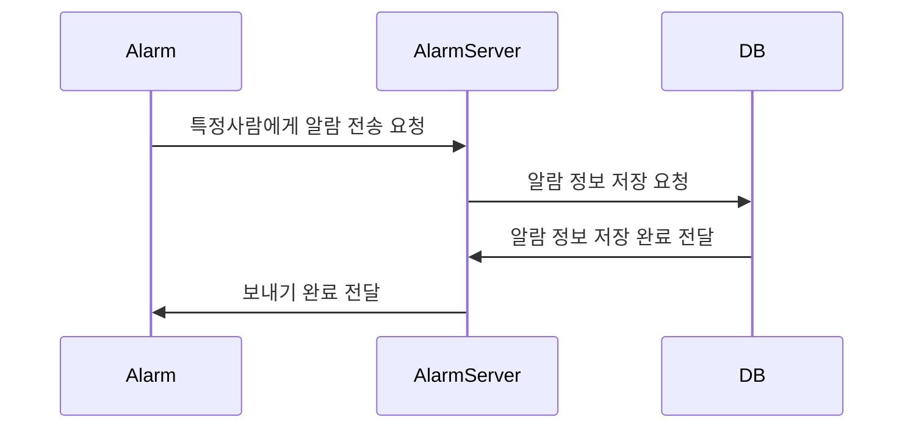
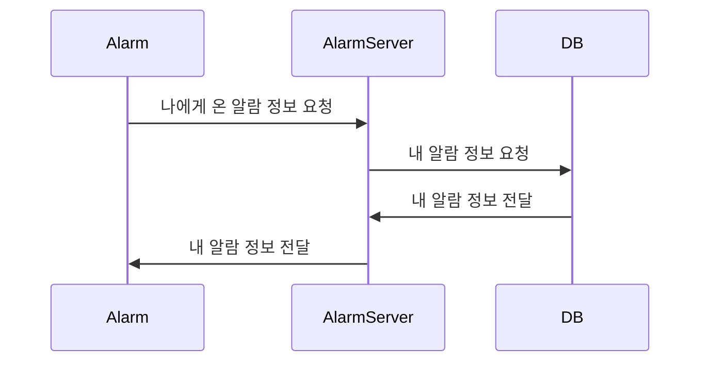

## Sequence Diagram

### :black_small_square: Alarm Send/receive

> 알람 보내는 과정

```mermaid
sequenceDiagram

    Alarm->>AlarmServer: 특정사람에게 알람 전송 요청
    AlarmServer->>DB: 알람 정보 저장 요청
    DB->>AlarmServer: 알람 정보 저장 완료 전달
    AlarmServer->>Alarm: 보내기 완료 전달
```

> 알람 받는 과정

```mermaid
sequenceDiagram

    Alarm->>AlarmServer: 나에게 온 알람 정보 요청
    AlarmServer->>DB: 내 알람 정보 요청
    DB->>AlarmServer: 내 알람 정보 전달
    AlarmServer->>Alarm: 내 알람 정보 전달
```