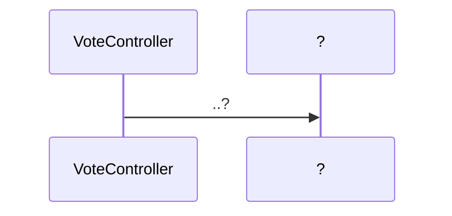
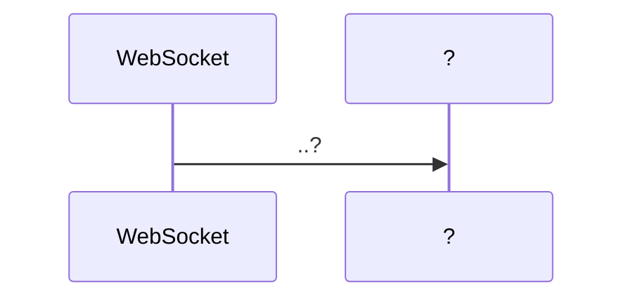

# InGameServer

>InGameServer는 `Frontend`와 `axios`와 `socket`을 사용해 통신합니다.
>
>InGameServer는 Java 언어를 사용해 `Spring`으로 구현되었습니다.
>
>`Frontend`의 `WaitRoom.vue`와 `PlayGame.vue`에서 각각 socket 2개, 3개로 연결되어있습니다.


## InGameServer Construction

```python
📦gameBack_InGame
 ┣ 📂.mvn
 ┃ ┗ 📂wrapper
 ┃ ┃ ┣ 📜maven-wrapper.jar
 ┃ ┃ ┣ 📜maven-wrapper.properties
 ┃ ┃ ┗ 📜MavenWrapperDownloader.java
 ┣ 📂.settings
 ┃ ┣ 📜org.eclipse.core.resources.prefs
 ┃ ┣ 📜org.eclipse.jdt.core.prefs
 ┃ ┣ 📜org.eclipse.wst.common.project.facet.core.xml
 ┃ ┗ 📜org.springframework.ide.eclipse.prefs
 ┣ 📂src
 ┃ ┣ 📂main
 ┃ ┃ ┣ 📂java
 ┃ ┃ ┃ ┗ 📂com
 ┃ ┃ ┃ ┃ ┗ 📂ssafy
 ┃ ┃ ┃ ┃ ┃ ┗ 📂pjt3
 ┃ ┃ ┃ ┃ ┃ ┃ ┣ 📂config
 ┃ ┃ ┃ ┃ ┃ ┃ ┃ ┣ 📜SwaggerConfig.java
 ┃ ┃ ┃ ┃ ┃ ┃ ┃ ┗ 📜WebSocketConfig.java
 ┃ ┃ ┃ ┃ ┃ ┃ ┣ 📂controller
 ┃ ┃ ┃ ┃ ┃ ┃ ┃ ┣ 📜DrawController.java
 ┃ ┃ ┃ ┃ ┃ ┃ ┃ ┣ 📜GameController.java
 ┃ ┃ ┃ ┃ ┃ ┃ ┃ ┗ 📜VoteController.java
 ┃ ┃ ┃ ┃ ┃ ┃ ┣ 📂dao
 ┃ ┃ ┃ ┃ ┃ ┃ ┃ ┣ 📜GameDao.java
 ┃ ┃ ┃ ┃ ┃ ┃ ┃ ┣ 📜GameDaoImpl.java
 ┃ ┃ ┃ ┃ ┃ ┃ ┃ ┣ 📜RoomDao.java
 ┃ ┃ ┃ ┃ ┃ ┃ ┃ ┣ 📜RoomDaoImpl.java
 ┃ ┃ ┃ ┃ ┃ ┃ ┃ ┣ 📜UserDao.java
 ┃ ┃ ┃ ┃ ┃ ┃ ┃ ┣ 📜UserDaoImpl.java
 ┃ ┃ ┃ ┃ ┃ ┃ ┃ ┣ 📜VoteDao.java
 ┃ ┃ ┃ ┃ ┃ ┃ ┃ ┗ 📜VoteDaoImpl.java
 ┃ ┃ ┃ ┃ ┃ ┃ ┣ 📂dto
 ┃ ┃ ┃ ┃ ┃ ┃ ┃ ┣ 📜Room.java
 ┃ ┃ ┃ ┃ ┃ ┃ ┃ ┣ 📜Topic.java
 ┃ ┃ ┃ ┃ ┃ ┃ ┃ ┣ 📜User.java
 ┃ ┃ ┃ ┃ ┃ ┃ ┃ ┣ 📜UserRoom.java
 ┃ ┃ ┃ ┃ ┃ ┃ ┃ ┗ 📜Vote.java
 ┃ ┃ ┃ ┃ ┃ ┃ ┣ 📂handler
 ┃ ┃ ┃ ┃ ┃ ┃ ┃ ┣ 📜ChatSocketHandler.java
 ┃ ┃ ┃ ┃ ┃ ┃ ┃ ┣ 📜CoordinateSocketHandler.java
 ┃ ┃ ┃ ┃ ┃ ┃ ┃ ┗ 📜RoomSocketHandler.java
 ┃ ┃ ┃ ┃ ┃ ┃ ┣ 📂model
 ┃ ┃ ┃ ┃ ┃ ┃ ┃ ┣ 📜BasicResponse.java
 ┃ ┃ ┃ ┃ ┃ ┃ ┃ ┣ 📜ChatMessage.java
 ┃ ┃ ┃ ┃ ┃ ┃ ┃ ┣ 📜DrawMessage.java
 ┃ ┃ ┃ ┃ ┃ ┃ ┃ ┣ 📜GameData.java
 ┃ ┃ ┃ ┃ ┃ ┃ ┃ ┣ 📜point.java
 ┃ ┃ ┃ ┃ ┃ ┃ ┃ ┣ 📜ServiceMessage.java
 ┃ ┃ ┃ ┃ ┃ ┃ ┃ ┣ 📜UserData.java
 ┃ ┃ ┃ ┃ ┃ ┃ ┃ ┣ 📜VoteData.java
 ┃ ┃ ┃ ┃ ┃ ┃ ┃ ┗ 📜WaitRoomData.java
 ┃ ┃ ┃ ┃ ┃ ┃ ┣ 📂service
 ┃ ┃ ┃ ┃ ┃ ┃ ┃ ┣ 📜GameService.java
 ┃ ┃ ┃ ┃ ┃ ┃ ┃ ┣ 📜GameServiceImpl.java
 ┃ ┃ ┃ ┃ ┃ ┃ ┃ ┣ 📜RoomService.java
 ┃ ┃ ┃ ┃ ┃ ┃ ┃ ┣ 📜RoomServiceImpl.java
 ┃ ┃ ┃ ┃ ┃ ┃ ┃ ┣ 📜UserService.java
 ┃ ┃ ┃ ┃ ┃ ┃ ┃ ┣ 📜UserServiceImpl.java
 ┃ ┃ ┃ ┃ ┃ ┃ ┃ ┣ 📜VoteService.java
 ┃ ┃ ┃ ┃ ┃ ┃ ┃ ┗ 📜VoteServiceImpl.java
 ┃ ┃ ┃ ┃ ┃ ┃ ┗ 📜GameBackInGameApplication.java
 ┃ ┃ ┗ 📂resources
 ┃ ┃ ┃ ┣ 📂config
 ┃ ┃ ┃ ┃ ┗ 📜mybatis-config.xml
 ┃ ┃ ┃ ┣ 📂mappers
 ┃ ┃ ┃ ┃ ┣ 📜room.xml
 ┃ ┃ ┃ ┃ ┣ 📜user.xml
 ┃ ┃ ┃ ┃ ┗ 📜vote.xml
 ┃ ┃ ┃ ┗ 📜application.properties
 ┃ ┗ 📂test
 ┃ ┃ ┗ 📂java
 ┃ ┃ ┃ ┗ 📂com
 ┃ ┃ ┃ ┃ ┗ 📂ssafy
 ┃ ┃ ┃ ┃ ┃ ┗ 📂pjt3
 ┃ ┃ ┃ ┃ ┃ ┃ ┗ 📜GameBackInGameApplicationTests.java
 ┣ 📂target
 ┃ ┣ 📂classes
 ┃ ┃ ┣ 📂com
 ┃ ┃ ┃ ┗ 📂ssafy
 ┃ ┃ ┃ ┃ ┗ 📂pjt3
 ┃ ┃ ┃ ┃ ┃ ┣ 📂config
 ┃ ┃ ┃ ┃ ┃ ┃ ┣ 📜WebSocketConfig.class
 ┃ ┃ ┃ ┃ ┃ ┃ ┗ 📜WebStompConfig.class
 ┃ ┃ ┃ ┃ ┃ ┣ 📂controller
 ┃ ┃ ┃ ┃ ┃ ┃ ┣ 📜DrawController.class
 ┃ ┃ ┃ ┃ ┃ ┃ ┣ 📜GameController.class
 ┃ ┃ ┃ ┃ ┃ ┃ ┣ 📜VoteController$1.class
 ┃ ┃ ┃ ┃ ┃ ┃ ┣ 📜VoteController.class
 ┃ ┃ ┃ ┃ ┃ ┃ ┗ 📜WebSocketEventListener.class
 ┃ ┃ ┃ ┃ ┃ ┣ 📂dao
 ┃ ┃ ┃ ┃ ┃ ┃ ┣ 📜GameDao.class
 ┃ ┃ ┃ ┃ ┃ ┃ ┣ 📜GameDaoImpl.class
 ┃ ┃ ┃ ┃ ┃ ┃ ┣ 📜RoomDao.class
 ┃ ┃ ┃ ┃ ┃ ┃ ┣ 📜RoomDaoImpl.class
 ┃ ┃ ┃ ┃ ┃ ┃ ┣ 📜UserDao.class
 ┃ ┃ ┃ ┃ ┃ ┃ ┣ 📜UserDaoImpl.class
 ┃ ┃ ┃ ┃ ┃ ┃ ┣ 📜VoteDao.class
 ┃ ┃ ┃ ┃ ┃ ┃ ┗ 📜VoteDaoImpl.class
 ┃ ┃ ┃ ┃ ┃ ┣ 📂dto
 ┃ ┃ ┃ ┃ ┃ ┃ ┣ 📜Room.class
 ┃ ┃ ┃ ┃ ┃ ┃ ┣ 📜Topic.class
 ┃ ┃ ┃ ┃ ┃ ┃ ┣ 📜User.class
 ┃ ┃ ┃ ┃ ┃ ┃ ┣ 📜UserRoom.class
 ┃ ┃ ┃ ┃ ┃ ┃ ┗ 📜Vote.class
 ┃ ┃ ┃ ┃ ┃ ┣ 📂handler
 ┃ ┃ ┃ ┃ ┃ ┃ ┣ 📜ChatSocketHandler.class
 ┃ ┃ ┃ ┃ ┃ ┃ ┗ 📜RoomSocketHandler.class
 ┃ ┃ ┃ ┃ ┃ ┣ 📂model
 ┃ ┃ ┃ ┃ ┃ ┃ ┣ 📜BasicResponse.class
 ┃ ┃ ┃ ┃ ┃ ┃ ┣ 📜ChatMessage$MessageType.class
 ┃ ┃ ┃ ┃ ┃ ┃ ┣ 📜ChatMessage.class
 ┃ ┃ ┃ ┃ ┃ ┃ ┣ 📜DrawMessage$MessageType.class
 ┃ ┃ ┃ ┃ ┃ ┃ ┣ 📜DrawMessage.class
 ┃ ┃ ┃ ┃ ┃ ┃ ┣ 📜GameData.class
 ┃ ┃ ┃ ┃ ┃ ┃ ┣ 📜point.class
 ┃ ┃ ┃ ┃ ┃ ┃ ┣ 📜ServiceMessage$MessageType.class
 ┃ ┃ ┃ ┃ ┃ ┃ ┣ 📜ServiceMessage.class
 ┃ ┃ ┃ ┃ ┃ ┃ ┣ 📜UserData.class
 ┃ ┃ ┃ ┃ ┃ ┃ ┣ 📜VoteData.class
 ┃ ┃ ┃ ┃ ┃ ┃ ┗ 📜WaitRoomData.class
 ┃ ┃ ┃ ┃ ┃ ┣ 📂service
 ┃ ┃ ┃ ┃ ┃ ┃ ┣ 📜GameService.class
 ┃ ┃ ┃ ┃ ┃ ┃ ┣ 📜GameServiceImpl.class
 ┃ ┃ ┃ ┃ ┃ ┃ ┣ 📜RoomService.class
 ┃ ┃ ┃ ┃ ┃ ┃ ┣ 📜RoomServiceImpl.class
 ┃ ┃ ┃ ┃ ┃ ┃ ┣ 📜UserService.class
 ┃ ┃ ┃ ┃ ┃ ┃ ┣ 📜UserServiceImpl.class
 ┃ ┃ ┃ ┃ ┃ ┃ ┣ 📜VoteService.class
 ┃ ┃ ┃ ┃ ┃ ┃ ┗ 📜VoteServiceImpl.class
 ┃ ┃ ┃ ┃ ┃ ┗ 📜GameBackInGameApplication.class
 ┃ ┃ ┣ 📂config
 ┃ ┃ ┃ ┗ 📜mybatis-config.xml
 ┃ ┃ ┣ 📂mappers
 ┃ ┃ ┃ ┣ 📜room.xml
 ┃ ┃ ┃ ┣ 📜user.xml
 ┃ ┃ ┃ ┗ 📜vote.xml
 ┃ ┃ ┣ 📂META-INF
 ┃ ┃ ┃ ┣ 📂maven
 ┃ ┃ ┃ ┃ ┗ 📂com.ssafy
 ┃ ┃ ┃ ┃ ┃ ┗ 📂gameBack_InGame
 ┃ ┃ ┃ ┃ ┃ ┃ ┣ 📜pom.properties
 ┃ ┃ ┃ ┃ ┃ ┃ ┗ 📜pom.xml
 ┃ ┃ ┃ ┗ 📜MANIFEST.MF
 ┃ ┃ ┗ 📜application.properties
 ┃ ┗ 📂test-classes
 ┃ ┃ ┗ 📂com
 ┃ ┃ ┃ ┗ 📂ssafy
 ┃ ┃ ┃ ┃ ┗ 📂pjt3
 ┃ ┃ ┃ ┃ ┃ ┗ 📜GameBackInGameApplicationTests.class
 ┣ 📜.classpath
 ┣ 📜.gitignore
 ┣ 📜.project
 ┣ 📜mvnw
 ┣ 📜mvnw.cmd
 ┗ 📜pom.xml
```


## Sequence Diagram

### :black_small_square: Game

> ?


### :black_small_square: Vote

> ?




### :black_small_square: Draw

> ?


### :black_small_square: WebSocket

> ?

