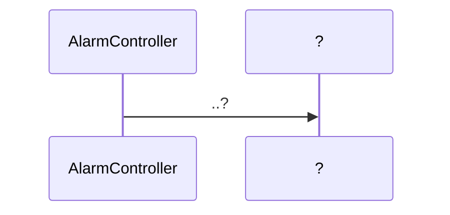
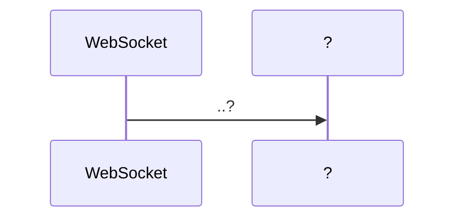

# LobbyServer

>LobbyServer는 `Frontend`와 `axios`와 `socket`을 사용해 통신합니다.
>
>LobbyServer는 Java 언어를 사용해 `Spring`으로 구현되었습니다.
>
>`Frontend`의 `lobby.vue`에서 socket 1개로 연결되어있습니다.


## LobbyServer Construction

```python
📦gameBack_Lobby
 ┣ 📂.mvn
 ┃ ┗ 📂wrapper
 ┃ ┃ ┣ 📜maven-wrapper.jar
 ┃ ┃ ┣ 📜maven-wrapper.properties
 ┃ ┃ ┗ 📜MavenWrapperDownloader.java
 ┣ 📂.settings
 ┃ ┣ 📜org.eclipse.core.resources.prefs
 ┃ ┣ 📜org.eclipse.jdt.core.prefs
 ┃ ┣ 📜org.eclipse.wst.common.project.facet.core.xml
 ┃ ┗ 📜org.springframework.ide.eclipse.prefs
 ┣ 📂bin
 ┃ ┣ 📂.mvn
 ┃ ┃ ┗ 📂wrapper
 ┃ ┃ ┃ ┣ 📜maven-wrapper.jar
 ┃ ┃ ┃ ┣ 📜maven-wrapper.properties
 ┃ ┃ ┃ ┗ 📜MavenWrapperDownloader.class
 ┃ ┣ 📂.settings
 ┃ ┃ ┗ 📜org.eclipse.core.resources.prefs
 ┃ ┣ 📂src
 ┃ ┃ ┣ 📂main
 ┃ ┃ ┃ ┣ 📂java
 ┃ ┃ ┃ ┃ ┗ 📂com
 ┃ ┃ ┃ ┃ ┃ ┗ 📂ssafy
 ┃ ┃ ┃ ┃ ┃ ┃ ┗ 📂pjt3
 ┃ ┃ ┃ ┃ ┃ ┃ ┃ ┣ 📂config
 ┃ ┃ ┃ ┃ ┃ ┃ ┃ ┃ ┣ 📜SwaggerConfig.class
 ┃ ┃ ┃ ┃ ┃ ┃ ┃ ┃ ┗ 📜WebSocketConfig.class
 ┃ ┃ ┃ ┃ ┃ ┃ ┃ ┣ 📂controller
 ┃ ┃ ┃ ┃ ┃ ┃ ┃ ┃ ┣ 📜AlarmController.class
 ┃ ┃ ┃ ┃ ┃ ┃ ┃ ┃ ┣ 📜RoomController.class
 ┃ ┃ ┃ ┃ ┃ ┃ ┃ ┃ ┗ 📜UserController.class
 ┃ ┃ ┃ ┃ ┃ ┃ ┃ ┣ 📂dao
 ┃ ┃ ┃ ┃ ┃ ┃ ┃ ┃ ┣ 📜AlarmDao.class
 ┃ ┃ ┃ ┃ ┃ ┃ ┃ ┃ ┣ 📜AlarmDaoImpl.class
 ┃ ┃ ┃ ┃ ┃ ┃ ┃ ┃ ┣ 📜RoomDao.class
 ┃ ┃ ┃ ┃ ┃ ┃ ┃ ┃ ┣ 📜RoomDaoImpl.class
 ┃ ┃ ┃ ┃ ┃ ┃ ┃ ┃ ┣ 📜UserDao.class
 ┃ ┃ ┃ ┃ ┃ ┃ ┃ ┃ ┗ 📜UserDaoImpl.class
 ┃ ┃ ┃ ┃ ┃ ┃ ┃ ┣ 📂dto
 ┃ ┃ ┃ ┃ ┃ ┃ ┃ ┃ ┣ 📜Alarm.class
 ┃ ┃ ┃ ┃ ┃ ┃ ┃ ┃ ┣ 📜Room.class
 ┃ ┃ ┃ ┃ ┃ ┃ ┃ ┃ ┣ 📜User.class
 ┃ ┃ ┃ ┃ ┃ ┃ ┃ ┃ ┣ 📜Userconnect.class
 ┃ ┃ ┃ ┃ ┃ ┃ ┃ ┃ ┗ 📜UserRoom.class
 ┃ ┃ ┃ ┃ ┃ ┃ ┃ ┣ 📂handler
 ┃ ┃ ┃ ┃ ┃ ┃ ┃ ┃ ┣ 📜ChatSocketHandler.class
 ┃ ┃ ┃ ┃ ┃ ┃ ┃ ┃ ┗ 📜ConnectSocketHandler.class
 ┃ ┃ ┃ ┃ ┃ ┃ ┃ ┣ 📂interceptor
 ┃ ┃ ┃ ┃ ┃ ┃ ┃ ┃ ┣ 📜HandshakeInterceptor.class
 ┃ ┃ ┃ ┃ ┃ ┃ ┃ ┃ ┗ 📜HandshakeInterceptorTwo.class
 ┃ ┃ ┃ ┃ ┃ ┃ ┃ ┣ 📂model
 ┃ ┃ ┃ ┃ ┃ ┃ ┃ ┃ ┣ 📜AlarmData.class
 ┃ ┃ ┃ ┃ ┃ ┃ ┃ ┃ ┣ 📜BasicResponse.class
 ┃ ┃ ┃ ┃ ┃ ┃ ┃ ┃ ┣ 📜ChatMessage$MessageType.class
 ┃ ┃ ┃ ┃ ┃ ┃ ┃ ┃ ┣ 📜ChatMessage.class
 ┃ ┃ ┃ ┃ ┃ ┃ ┃ ┃ ┣ 📜LoginCheck.class
 ┃ ┃ ┃ ┃ ┃ ┃ ┃ ┃ ┣ 📜ServiceMessage$MessageType.class
 ┃ ┃ ┃ ┃ ┃ ┃ ┃ ┃ ┣ 📜ServiceMessage.class
 ┃ ┃ ┃ ┃ ┃ ┃ ┃ ┃ ┗ 📜UserData.class
 ┃ ┃ ┃ ┃ ┃ ┃ ┃ ┣ 📂service
 ┃ ┃ ┃ ┃ ┃ ┃ ┃ ┃ ┣ 📜AlarmService.class
 ┃ ┃ ┃ ┃ ┃ ┃ ┃ ┃ ┣ 📜AlarmServiceImpl.class
 ┃ ┃ ┃ ┃ ┃ ┃ ┃ ┃ ┣ 📜RoomService.class
 ┃ ┃ ┃ ┃ ┃ ┃ ┃ ┃ ┣ 📜RoomServiceImpl.class
 ┃ ┃ ┃ ┃ ┃ ┃ ┃ ┃ ┣ 📜UserService.class
 ┃ ┃ ┃ ┃ ┃ ┃ ┃ ┃ ┗ 📜UserServiceImpl.class
 ┃ ┃ ┃ ┃ ┃ ┃ ┃ ┗ 📜GameBackLobbyApplication.class
 ┃ ┃ ┃ ┗ 📂resources
 ┃ ┃ ┃ ┃ ┣ 📂config
 ┃ ┃ ┃ ┃ ┃ ┗ 📜mybatis-config.xml
 ┃ ┃ ┃ ┃ ┣ 📂mappers
 ┃ ┃ ┃ ┃ ┃ ┣ 📜alarm.xml
 ┃ ┃ ┃ ┃ ┃ ┣ 📜room.xml
 ┃ ┃ ┃ ┃ ┃ ┗ 📜user.xml
 ┃ ┃ ┃ ┃ ┗ 📜application.properties
 ┃ ┃ ┗ 📂test
 ┃ ┃ ┃ ┗ 📂java
 ┃ ┃ ┃ ┃ ┗ 📂com
 ┃ ┃ ┃ ┃ ┃ ┗ 📂ssafy
 ┃ ┃ ┃ ┃ ┃ ┃ ┗ 📂pjt3
 ┃ ┃ ┃ ┃ ┃ ┃ ┃ ┗ 📜GameBackLobbyApplicationTests.class
 ┃ ┣ 📂target
 ┃ ┃ ┗ 📂classes
 ┃ ┃ ┃ ┗ 📂META-INF
 ┃ ┃ ┃ ┃ ┗ 📜MANIFEST.MF
 ┃ ┣ 📜.gitignore
 ┃ ┣ 📜.project
 ┃ ┣ 📜mvnw
 ┃ ┣ 📜mvnw.cmd
 ┃ ┗ 📜pom.xml
 ┣ 📂src
 ┃ ┣ 📂main
 ┃ ┃ ┣ 📂java
 ┃ ┃ ┃ ┗ 📂com
 ┃ ┃ ┃ ┃ ┗ 📂ssafy
 ┃ ┃ ┃ ┃ ┃ ┗ 📂pjt3
 ┃ ┃ ┃ ┃ ┃ ┃ ┣ 📂config
 ┃ ┃ ┃ ┃ ┃ ┃ ┃ ┣ 📜SwaggerConfig.java
 ┃ ┃ ┃ ┃ ┃ ┃ ┃ ┗ 📜WebSocketConfig.java
 ┃ ┃ ┃ ┃ ┃ ┃ ┣ 📂controller
 ┃ ┃ ┃ ┃ ┃ ┃ ┃ ┣ 📜AlarmController.java
 ┃ ┃ ┃ ┃ ┃ ┃ ┃ ┣ 📜RoomController.java
 ┃ ┃ ┃ ┃ ┃ ┃ ┃ ┗ 📜UserController.java
 ┃ ┃ ┃ ┃ ┃ ┃ ┣ 📂dao
 ┃ ┃ ┃ ┃ ┃ ┃ ┃ ┣ 📜AlarmDao.java
 ┃ ┃ ┃ ┃ ┃ ┃ ┃ ┣ 📜AlarmDaoImpl.java
 ┃ ┃ ┃ ┃ ┃ ┃ ┃ ┣ 📜RoomDao.java
 ┃ ┃ ┃ ┃ ┃ ┃ ┃ ┣ 📜RoomDaoImpl.java
 ┃ ┃ ┃ ┃ ┃ ┃ ┃ ┣ 📜UserDao.java
 ┃ ┃ ┃ ┃ ┃ ┃ ┃ ┗ 📜UserDaoImpl.java
 ┃ ┃ ┃ ┃ ┃ ┃ ┣ 📂dto
 ┃ ┃ ┃ ┃ ┃ ┃ ┃ ┣ 📜Alarm.java
 ┃ ┃ ┃ ┃ ┃ ┃ ┃ ┣ 📜Room.java
 ┃ ┃ ┃ ┃ ┃ ┃ ┃ ┣ 📜User.java
 ┃ ┃ ┃ ┃ ┃ ┃ ┃ ┣ 📜Userconnect.java
 ┃ ┃ ┃ ┃ ┃ ┃ ┃ ┗ 📜UserRoom.java
 ┃ ┃ ┃ ┃ ┃ ┃ ┣ 📂handler
 ┃ ┃ ┃ ┃ ┃ ┃ ┃ ┗ 📜ChatSocketHandler.java
 ┃ ┃ ┃ ┃ ┃ ┃ ┣ 📂interceptor
 ┃ ┃ ┃ ┃ ┃ ┃ ┃ ┣ 📜HandshakeInterceptor.java
 ┃ ┃ ┃ ┃ ┃ ┃ ┃ ┗ 📜HandshakeInterceptorTwo.java
 ┃ ┃ ┃ ┃ ┃ ┃ ┣ 📂model
 ┃ ┃ ┃ ┃ ┃ ┃ ┃ ┣ 📜AlarmData.java
 ┃ ┃ ┃ ┃ ┃ ┃ ┃ ┣ 📜BasicResponse.java
 ┃ ┃ ┃ ┃ ┃ ┃ ┃ ┣ 📜ChatMessage.java
 ┃ ┃ ┃ ┃ ┃ ┃ ┃ ┣ 📜LoginCheck.java
 ┃ ┃ ┃ ┃ ┃ ┃ ┃ ┣ 📜ServiceMessage.java
 ┃ ┃ ┃ ┃ ┃ ┃ ┃ ┗ 📜UserData.java
 ┃ ┃ ┃ ┃ ┃ ┃ ┣ 📂service
 ┃ ┃ ┃ ┃ ┃ ┃ ┃ ┣ 📜AlarmService.java
 ┃ ┃ ┃ ┃ ┃ ┃ ┃ ┣ 📜AlarmServiceImpl.java
 ┃ ┃ ┃ ┃ ┃ ┃ ┃ ┣ 📜RoomService.java
 ┃ ┃ ┃ ┃ ┃ ┃ ┃ ┣ 📜RoomServiceImpl.java
 ┃ ┃ ┃ ┃ ┃ ┃ ┃ ┣ 📜UserService.java
 ┃ ┃ ┃ ┃ ┃ ┃ ┃ ┗ 📜UserServiceImpl.java
 ┃ ┃ ┃ ┃ ┃ ┃ ┗ 📜GameBackLobbyApplication.java
 ┃ ┃ ┗ 📂resources
 ┃ ┃ ┃ ┣ 📂config
 ┃ ┃ ┃ ┃ ┗ 📜mybatis-config.xml
 ┃ ┃ ┃ ┣ 📂mappers
 ┃ ┃ ┃ ┃ ┣ 📜alarm.xml
 ┃ ┃ ┃ ┃ ┣ 📜room.xml
 ┃ ┃ ┃ ┃ ┗ 📜user.xml
 ┃ ┃ ┃ ┗ 📜application.properties
 ┃ ┗ 📂test
 ┃ ┃ ┗ 📂java
 ┃ ┃ ┃ ┗ 📂com
 ┃ ┃ ┃ ┃ ┗ 📂ssafy
 ┃ ┃ ┃ ┃ ┃ ┗ 📂pjt3
 ┃ ┃ ┃ ┃ ┃ ┃ ┗ 📜GameBackLobbyApplicationTests.java
 ┣ 📂target
 ┃ ┣ 📂classes
 ┃ ┃ ┣ 📂com
 ┃ ┃ ┃ ┗ 📂ssafy
 ┃ ┃ ┃ ┃ ┗ 📂pjt3
 ┃ ┃ ┃ ┃ ┃ ┣ 📂config
 ┃ ┃ ┃ ┃ ┃ ┃ ┣ 📜SwaggerConfig.class
 ┃ ┃ ┃ ┃ ┃ ┃ ┗ 📜WebSocketConfig.class
 ┃ ┃ ┃ ┃ ┃ ┣ 📂controller
 ┃ ┃ ┃ ┃ ┃ ┃ ┣ 📜AlarmController.class
 ┃ ┃ ┃ ┃ ┃ ┃ ┣ 📜RoomController.class
 ┃ ┃ ┃ ┃ ┃ ┃ ┗ 📜UserController.class
 ┃ ┃ ┃ ┃ ┃ ┣ 📂dao
 ┃ ┃ ┃ ┃ ┃ ┃ ┣ 📜AlarmDao.class
 ┃ ┃ ┃ ┃ ┃ ┃ ┣ 📜AlarmDaoImpl.class
 ┃ ┃ ┃ ┃ ┃ ┃ ┣ 📜RoomDao.class
 ┃ ┃ ┃ ┃ ┃ ┃ ┣ 📜RoomDaoImpl.class
 ┃ ┃ ┃ ┃ ┃ ┃ ┣ 📜UserDao.class
 ┃ ┃ ┃ ┃ ┃ ┃ ┗ 📜UserDaoImpl.class
 ┃ ┃ ┃ ┃ ┃ ┣ 📂dto
 ┃ ┃ ┃ ┃ ┃ ┃ ┣ 📜Alarm.class
 ┃ ┃ ┃ ┃ ┃ ┃ ┣ 📜Room.class
 ┃ ┃ ┃ ┃ ┃ ┃ ┣ 📜User.class
 ┃ ┃ ┃ ┃ ┃ ┃ ┣ 📜Userconnect.class
 ┃ ┃ ┃ ┃ ┃ ┃ ┗ 📜UserRoom.class
 ┃ ┃ ┃ ┃ ┃ ┣ 📂handler
 ┃ ┃ ┃ ┃ ┃ ┃ ┣ 📜ChatSocketHandler.class
 ┃ ┃ ┃ ┃ ┃ ┃ ┗ 📜ConnectSocketHandler.class
 ┃ ┃ ┃ ┃ ┃ ┣ 📂interceptor
 ┃ ┃ ┃ ┃ ┃ ┃ ┣ 📜HandshakeInterceptor.class
 ┃ ┃ ┃ ┃ ┃ ┃ ┗ 📜HandshakeInterceptorTwo.class
 ┃ ┃ ┃ ┃ ┃ ┣ 📂model
 ┃ ┃ ┃ ┃ ┃ ┃ ┣ 📜AlarmData.class
 ┃ ┃ ┃ ┃ ┃ ┃ ┣ 📜BasicResponse.class
 ┃ ┃ ┃ ┃ ┃ ┃ ┣ 📜ChatMessage$MessageType.class
 ┃ ┃ ┃ ┃ ┃ ┃ ┣ 📜ChatMessage.class
 ┃ ┃ ┃ ┃ ┃ ┃ ┣ 📜LoginCheck.class
 ┃ ┃ ┃ ┃ ┃ ┃ ┣ 📜ServiceMessage$MessageType.class
 ┃ ┃ ┃ ┃ ┃ ┃ ┣ 📜ServiceMessage.class
 ┃ ┃ ┃ ┃ ┃ ┃ ┗ 📜UserData.class
 ┃ ┃ ┃ ┃ ┃ ┣ 📂service
 ┃ ┃ ┃ ┃ ┃ ┃ ┣ 📜AlarmService.class
 ┃ ┃ ┃ ┃ ┃ ┃ ┣ 📜AlarmServiceImpl.class
 ┃ ┃ ┃ ┃ ┃ ┃ ┣ 📜RoomService.class
 ┃ ┃ ┃ ┃ ┃ ┃ ┣ 📜RoomServiceImpl.class
 ┃ ┃ ┃ ┃ ┃ ┃ ┣ 📜UserService.class
 ┃ ┃ ┃ ┃ ┃ ┃ ┗ 📜UserServiceImpl.class
 ┃ ┃ ┃ ┃ ┃ ┗ 📜GameBackLobbyApplication.class
 ┃ ┃ ┣ 📂config
 ┃ ┃ ┃ ┗ 📜mybatis-config.xml
 ┃ ┃ ┣ 📂mappers
 ┃ ┃ ┃ ┣ 📜alarm.xml
 ┃ ┃ ┃ ┣ 📜room.xml
 ┃ ┃ ┃ ┗ 📜user.xml
 ┃ ┃ ┣ 📂META-INF
 ┃ ┃ ┃ ┣ 📂maven
 ┃ ┃ ┃ ┃ ┗ 📂com.ssafy
 ┃ ┃ ┃ ┃ ┃ ┗ 📂gameBack_Lobby
 ┃ ┃ ┃ ┃ ┃ ┃ ┣ 📜pom.properties
 ┃ ┃ ┃ ┃ ┃ ┃ ┗ 📜pom.xml
 ┃ ┃ ┃ ┗ 📜MANIFEST.MF
 ┃ ┃ ┗ 📜application.properties
 ┃ ┗ 📂test-classes
 ┃ ┃ ┗ 📂com
 ┃ ┃ ┃ ┗ 📂ssafy
 ┃ ┃ ┃ ┃ ┗ 📂pjt3
 ┃ ┃ ┃ ┃ ┃ ┗ 📜GameBackLobbyApplicationTests.class
 ┣ 📜.classpath
 ┣ 📜.gitignore
 ┣ 📜.project
 ┣ 📜mvnw
 ┣ 📜mvnw.cmd
 ┗ 📜pom.xml
```


## Sequence Diagram

### :black_small_square: Alarm

> ?



### :black_small_square: Room

> ?


### :black_small_square: User

> ?


### :black_small_square: WebSocket

> ?



